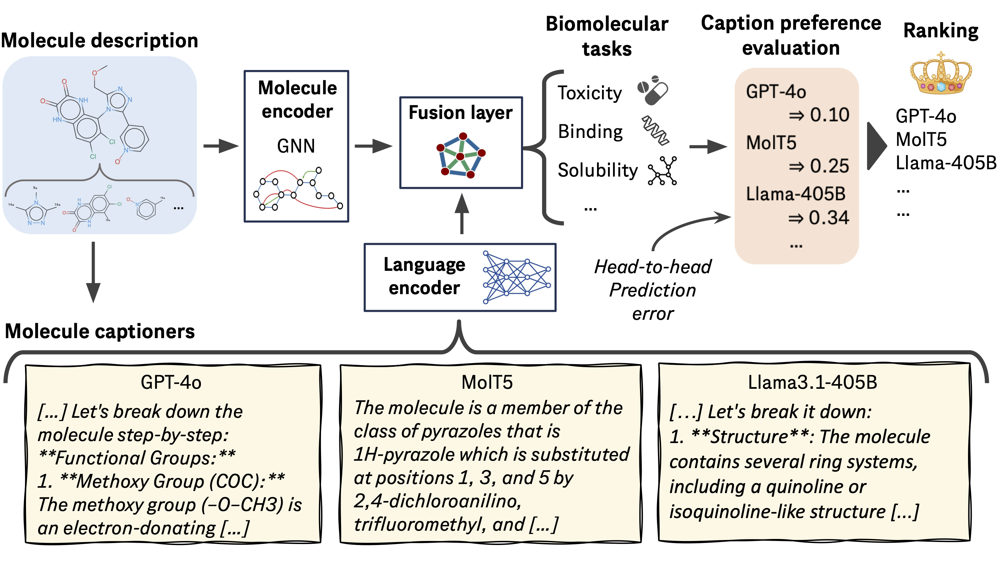

# MolCap-Arena: A Comprehensive Captioning Benchmark on Language-Enhanced Molecular Property Prediction
Associated repository for "[MolCap-Arena: A Comprehensive Captioning Benchmark on Language-Enhanced Molecular Property Prediction](https://arxiv.org/abs/)".

<p align="center">

</p>

## Table of Contents
 - [Submission](#submission)
 - [Installation](#installation)
 - [Running the benchmark](#running-the-benchmark)
 - [Evaluating a new model](#evaluating-a-new-model)
 - [Creating a new captioner](#creating-a-new-captioner)
 - [Adding a new dataset](#adding-a-new-dataset)
 - [Downloads](#downloads)
 - [Citation](#citation)
 - [Leaderboard](#leaderboard)


### Submission 

(link coming soon)

If you would like to submit a caption file for easy distribution for others to use when building a leaderboard, please submit [here](). It should follow the format of existing files and contain captions for molecules in all datasets.  

### Installation

There are two conda environments: 'MolCapArena' for evaluation, and 'Captioner' for captioning. 

```
conda env create -f environment.yml

conda env create -f environment_captioner.yml

conda activate MolCapArena
pip install -e .
```


### Running the benchmark

Download the 'battles.zip' file from [Downloads](#downloads). 

```
unzip battles.zip
conda activate MolCapArena
python leaderboard_scripts/create_metrics_h2h.py
python leaderboard_scripts/create_winrate_plot_h2h.py
```


### Evaluating a new model

Create a new file in captions called 'YOUR_NAME.csv'. It should contain a header line with at least two fields: 'SMILES' and 'captions'. All canonicalized SMILES from 'all_smiles.csv' should appear. 

Download the 'battles.zip', 'captions.zip', 'embeddings.zip', 'splits.zip' files from [Downloads](#downloads). 

```
unzip battles.zip
unzip captions.zip
unzip embeddings.zip
unzip splits.zip
```

Set important variables:
```
declare -a datasets=('BBBP' 'BACE' 'ClinTox' 'FreeSolv' 'ESOL' 'Lipo')
export DATASETS="${datasets[@]}"
export caption_name='YOUR_NAME'
export WANDB_MODE=disabled
conda activate MolCapArena
```

Run the four stages of the evaluation procedure: 1) model training, 2) embedding extraction, 3) multimodal SVM training, and 4) head-to-head captioner vs captioner battles. 
```
echo "Training caption embedding models"
for dataset in "${datasets[@]}"; do
    for run in {0..4}; do
        echo "$dataset:$run"
        python leaderboard_scripts/run_train.py --specific_caption="$caption_name" --dataset="$dataset" --max_epochs=20 --validate_every_n=0 --fold_idx=$run
    done
done


echo "Extracting captions"
for dataset in "${datasets[@]}"; do
    for run in {0..4}; do
        echo "$dataset:$run"
        python leaderboard_scripts/run_embeddings.py --specific_caption="$caption_name" --dataset=$dataset --fold_idx=$run --fold_idx=$run
    done
done

echo "Training single-caption predictors"
for dataset in "${datasets[@]}"; do
    for run in {0..4}; do
        echo "$dataset:$run"
        python leaderboard_scripts/head.py --dataset=$dataset --method=SVM --fold_idx=$run
    done
done

echo "Running head-to-head battles"
for dataset in "${datasets[@]}"; do
    for run in {0..4}; do
        echo "$dataset:$run"
        python leaderboard_scripts/head2head.py --dataset=$dataset --method=SVM --fold_idx=$run
    done
done
```

Finally, evaluate the leaderboard:
```
python leaderboard_scripts/create_metrics_h2h.py
```


### Creating a new captioner

Create a new captioner file by first copying an existing file as an example. Modify 'get_all_captions.py' to include YOUR_NAME as an option. 

```
conda activate Captioner

cp captioners/Llama3_8B_captioner.py captioners/YOUR_NAME_captioner.py

echo "Modify 'YOUR_NAME_captioner.py' and add an if statement to 'get_all_captions.py' to include it as an option."

python get_all_captions.py --model=YOUR_NAME --debug

python get_all_captions.py --model=YOUR_NAME

```

### Adding a new dataset

Currently, adding a new dataset is not fully supported. The rough steps are as follows:

1. Download and unzip 'splits.zip' files from [Downloads](#downloads). 
2. Generate a csv file for the dataset in 'splits/'. Modify 'create_splits.py' to include your dataset, then run it.
3. Modify 'build_smiles_list.py' to include the new dataset. Run 'build_smiles_list.py' then 'create_BRICS.py'.
4. Run captioners to generate new caption files.
    4.1. (Optional) Modify 'get_all_captions.py' to avoid re-captioning old molecules.
5. Run leaderboard_scripts as detailed above. Note that scripts require modification to accomodate new datasets. 


### Downloads

+ [battles](https://drive.google.com/file/d/1ohKJ2ISMnYvHYdLBPu-cZ32AX19xFiAa/view?usp=sharing)
+ [captions](https://drive.google.com/file/d/1R84VBuk6o5VlAymLmMjEjchNStXK9yTG/view?usp=sharing)
+ [embeddings](https://drive.google.com/file/d/1DbhEkawsplArg6VFmkAQbjuuRiemjnSq/view?usp=sharing)
+ [splits](https://drive.google.com/file/d/1ep2-mg3G2kMKKEF3Bmd69OUuf2D8psvr/view?usp=sharing)


### Citation
If you found our work useful, please cite:
```bibtex
@article{edwards2024molcap-arena,
  title={MolCap-Arena: A Comprehensive Captioning Benchmark on Language-Enhanced Molecular Property Prediction},
  author={Edwards, Carl and Lu, Ziqing and Hajiramezanali, Ehsan and
Biancalani, Tommaso and Ji, Heng and Scalia, Gabriele},
  journal={arXiv preprint arXiv:2411.XXXXX},
  year={2024}
}
```


### Leaderboard

Here is the leaderboard conveniently generated by GPT-4o (so results might be hallucinated). Please see [leaderboard_table.csv](leaderboard_table.csv) for real results. 


| Model                           | Rating  | 95% CI | ROC-AUC | BCE Loss | Avg. Error | Average Precision | Pearson R | Spearman R | R2    | MSE   | MAE  |
|---------------------------------|---------|--------|---------|----------|-------------|--------------------|-----------|------------|-------|-------|------|
| BioT5_plus                      | **1061**    | +3/-2| 87.359  | 0.335    | **0.471**       | 74.907             | 0.654     | 0.660      | 0.408 | 1.057 | 0.744|
| BioT5                           | 1059    | +3/-2| **87.371**  | **0.334**    | 0.472       | 74.631             | 0.654     | 0.658      | 0.409 | 1.057 | 0.744|
| LlaSMol                         | 1040    | +2/-3| 86.522  | 0.340    | 0.473       | 73.271             | 0.655     | 0.661      | 0.409 | 1.054 | 0.746|
| GPT-4o-Generic                  | 1032    | +2/-2| 85.685  | 0.341    | 0.472       | 72.388             | 0.657     | 0.662      | 0.412 | 1.049 | 0.742|
| TextChemT5                      | 1032    | +4/-2| 87.074  | 0.341    | 0.475       | **75.295**             | 0.652     | 0.657      | 0.407 | 1.057 | 0.746|
| Gemma2-9B-Frags-Drug            | 1031    | +3/-4| 85.543  | 0.343    | 0.475       | 72.435             | 0.653     | 0.657      | 0.407 | 1.062 | 0.747|
| Gemma2-9B-Frags-Chem            | 1030    | +3/-4| 85.619  | 0.342    | 0.475       | 72.312             | 0.652     | 0.657      | 0.406 | 1.061 | 0.747|
| Llama3.1-70B-Chem               | 1021    | +2/-2| 85.431  | 0.344    | 0.475       | 72.529             | 0.653     | 0.656      | 0.408 | 1.056 | 0.746|
| Llama3.1-70B-Generic            | 1021    | +1/-3| 85.618  | 0.344    | 0.474       | 72.373             | 0.653     | 0.657      | 0.408 | 1.054 | 0.744|
| MolT5                           | 1021    | +1/-4| 86.406  | 0.340    | 0.475       | 75.251             | 0.652     | 0.655      | 0.406 | 1.064 | 0.748|
| Gemma2-9B-Frags-Generic         | 1020    | +3/-3| 85.550  | 0.342    | 0.476       | 72.455             | 0.651     | 0.657      | 0.406 | 1.064 | 0.749|
| Llama3.1-70B-Drug               | 1020    | +1/-2| 85.594  | 0.343    | **0.471**       | 72.430             | 0.655     | 0.660      | 0.412 | 1.042 | 0.740|
| Llama3.1-405B-Generic           | 1020    | +3/-1| 85.469  | 0.342    | **0.471**       | 72.048             | **0.658**     | **0.663**      | **0.416** | **1.038** | **0.738**|
| Llama3-70B-Drug                 | 1017    | +2/-3| 85.392  | 0.343    | 0.472       | 72.179             | 0.656     | 0.660      | 0.413 | 1.047 | 0.741|
| MistralNeMo-12B-Frags-Generic   | 1017    | +2/-1| 85.376  | 0.345    | 0.473       | 72.022             | 0.653     | 0.658      | 0.408 | 1.051 | 0.742|
| Llama3.1-70B-Bio                | 1016    | +2/-2| 85.238  | 0.347    | 0.473       | 72.074             | 0.656     | 0.661      | 0.411 | 1.047 | 0.741|
| Gemma2-27B-Generic              | 1015    | +3/-3| 85.254  | 0.343    | **0.471**       | 72.152             | 0.654     | 0.661      | 0.412 | 1.043 | 0.739|
| Llama3-70B-Chem                 | 1014    | +2/-4| 85.355  | 0.344    | 0.473       | 72.181             | 0.655     | 0.659      | 0.409 | 1.053 | 0.742|
| Gemma2-27B-Chem                 | 1013    | +1/-3| 85.223  | 0.345    | 0.474       | 72.057             | 0.653     | 0.659      | 0.409 | 1.051 | 0.743|
| MistralNeMo-12B-Frags-Chem      | 1012    | +2/-3| 85.746  | 0.343    | 0.472       | 72.320             | 0.656     | 0.660      | 0.411 | 1.046 | 0.741|
| GPT-4o-Frags-Generic            | 1012    | +3/-2| 85.510  | 0.343    | 0.475       | 72.210             | 0.654     | 0.658      | 0.408 | 1.054 | 0.745|
| Llama3-8B-Task                  | 1009    | +1/-2| 85.414  | 0.344    | 0.477       | 72.182             | 0.652     | 0.656      | 0.406 | 1.063 | 0.748|
| MistralNeMo-12B-Frags-Drug      | 1008    | +3/-2| 85.731  | 0.344    | 0.473       | 72.436             | 0.654     | 0.659      | 0.410 | 1.046 | 0.742|
| Llama3-70B-Generic              | 1008    | +3/-2| 85.108  | 0.345    | 0.475       | 71.920             | 0.653     | 0.656      | 0.406 | 1.061 | 0.746|
| Gemma2-9B-Frags-Bio             | 1006    | +3/-3| 85.284  | 0.346    | 0.477       | 72.020             | 0.651     | 0.657      | 0.405 | 1.065 | 0.750|
| Llama3.1-70B-Quant              | 1006    | +3/-3| 85.312  | 0.344    | 0.474       | 72.163             | 0.653     | 0.660      | 0.408 | 1.052 | 0.743|
| Llama3.1-405B-Frags-Generic     | 1005    | +2/-2| 85.482  | 0.344    | 0.476       | 72.682             | 0.653     | 0.657      | 0.405 | 1.065 | 0.749|
| Gemma2-9B-Chem                  | 1004    | +1/-2| 85.455  | 0.343    | 0.474       | 72.112             | 0.653     | 0.657      | 0.409 | 1.057 | 0.745|
| Llama3-70B-Bio                  | 1003    | +1/-2| 85.479  | 0.344    | 0.476       | 72.253             | 0.651     | 0.656      | 0.403 | 1.066 | 0.748|
| Llama3-70B-Frags-Generic        | 1003    | +3/-3| 85.780  | 0.342    | 0.478       | 72.693             | 0.650     | 0.655      | 0.403 | 1.072 | 0.751|
| Llama3.1-8B-Drug                | 1003    | +4/-2| 85.088  | 0.345    | 0.475       | 72.004             | 0.654     | 0.657      | 0.410 | 1.052 | 0.745|
| Llama3.1-70B-Frags-Generic      | 1001    | +3/-2| 85.580  | 0.342    | 0.477       | 72.238             | 0.650     | 0.656      | 0.403 | 1.071 | 0.750|
| Llama3.1-70B-Frags-Chem         | 1001    | +3/-2| 85.512  | 0.343    | 0.477       | 72.306             | 0.651     | 0.657      | 0.404 | 1.070 | 0.749|
| Gemma2-27B-Frags-Drug           | 1001    | +2/-4| 85.644  | 0.342    | 0.477       | 72.333             | 0.649     | 0.653      | 0.402 | 1.069 | 0.752|
| MistralNeMo-12B-Bio             | 1000    | +1/-2| 85.301  | 0.344    | 0.476       | 72.144             | 0.650     | 0.655      | 0.403 | 1.066 | 0.748|
| Llama3-8B-Drug                  | 999     | +3/-2| 85.375  | 0.344    | 0.474       | 72.148             | 0.654     | 0.658      | 0.408 | 1.057 | 0.745|
| MistralNeMo-12B-Generic         | 999     | +1/-1| 85.421  | 0.343    | 0.477       | 72.113             | 0.650     | 0.654      | 0.403 | 1.069 | 0.750|
| Gemma2-27B-Bio                  | 998     | +2/-1| 85.347  | 0.343    | 0.476       | 72.176             | 0.652     | 0.657      | 0.405 | 1.061 | 0.747|
| Gemma2-9B-Bio                   | 997     | +3/-2| 85.392  | 0.344    | 0.475       | 72.139             | 0.651     | 0.656      | 0.406 | 1.057 | 0.746|
| Gemma2-9B-Frags-Quant           | 997     | +5/-2| 85.305  | 0.346    | 0.475       | 72.035             | 0.652     | 0.656      | 0.406 | 1.060 | 0.746|
| Gemma2-27B-Quant                | 997     | +3/-4| 85.348  | 0.346    | 0.476       | 72.120             | 0.651     | 0.656      | 0.405 | 1.061 | 0.746|
| MistralNeMo-12B-Frags-Bio       | 996     | +2/-3| 85.364  | 0.345    | 0.475       | 72.082             | 0.652     | 0.658      | 0.406 | 1.060 | 0.746|
| ChemDFM                         | 996     | +4/-3| 86.052  | 0.344    | 0.477       | 72.614             | 0.648     | 0.653      | 0.401 | 1.073 | 0.751|
| MistralNeMo-12B-Chem            | 996     | +1/-5| 85.418  | 0.346    | 0.475       | 72.201             | 0.651     | 0.655      | 0.406 | 1.063 | 0.746|
| 3D-MoLM                         | 996     | +2/-3| 86.032  | 0.341    | 0.475       | 73.161             | 0.651     | 0.655      | 0.406 | 1.062 | 0.748|
| ChemLLM                         | 996     | +3/-3| 85.810  | 0.342    | 0.475       | 72.849             | 0.650     | 0.654      | 0.405 | 1.063 | 0.747|
| Llama3-8B-Frags-Bio             | 996     | +2/-1| 85.338  | 0.344    | 0.477       | 72.102             | 0.652     | 0.657      | 0.405 | 1.071 | 0.750|
| Llama3-8B-Quant                 | 995     | +3/-4| 85.397  | 0.344    | 0.476       | 72.154             | 0.650     | 0.654      | 0.405 | 1.064 | 0.747|
| Llama3-8B-Frags-Chem            | 995     | +3/-2| 85.336  | 0.344    | 0.476       | 72.086             | 0.654     | 0.659      | 0.406 | 1.065 | 0.749|
| Llama3.1-8B-Generic             | 995     | +2/-3| 85.331  | 0.343    | 0.476       | 72.231             | 0.652     | 0.657      | 0.406 | 1.062 | 0.748|
| MistralNeMo-12B-Frags-Quant     | 994     | +3/-2| 85.194  | 0.344    | 0.476       | 72.143             | 0.651     | 0.655      | 0.403 | 1.065 | 0.749|
| Llama3-70B-Frags-Drug           | 994     | +3/-2| 85.590  | 0.342    | 0.478       | 72.270             | 0.650     | 0.655      | 0.402 | 1.073 | 0.751|
| Gemma2-27B-Drug                 | 994     | +3/-3| 85.332  | 0.344    | 0.473       | 72.067             | 0.653     | 0.659      | 0.409 | 1.045 | 0.741|
| Llama3-70B-Quant                | 993     | +2/-2| 85.241  | 0.344    | 0.474       | 72.109             | 0.654     | 0.657      | 0.408 | 1.055 | 0.745|
| Llama3-8B-Frags-Drug            | 993     | +2/-2| 85.352  | 0.343    | 0.477       | 72.144             | 0.652     | 0.656      | 0.406 | 1.064 | 0.748|
| Gemma2-9B-Generic               | 993     | +4/-3| 85.412  | 0.344    | 0.476       | 72.085             | 0.650     | 0.654      | 0.404 | 1.067 | 0.748|
| Llama3.1-8B-Chem                | 992     | +3/-2| 85.425  | 0.344    | 0.475       | 72.214             | 0.652     | 0.658      | 0.406 | 1.059 | 0.746|
| MolInstructions_molecule        | 992     | +4/-4| 85.747  | 0.342    | 0.477       | 72.594             | 0.650     | 0.654      | 0.402 | 1.070 | 0.750|
| Llama3.1-70B-Frags-Bio          | 991     | +4/-2| 85.379  | 0.343    | 0.477       | 72.171             | 0.649     | 0.653      | 0.401 | 1.075 | 0.751|
| Llama3-8B-Generic               | 991     | +4/-5| 85.349  | 0.344    | 0.476       | 72.227             | 0.650     | 0.656      | 0.405 | 1.062 | 0.747|
| Llama3-70B-Frags-Chem           | 990     | +2/-4| 85.295  | 0.345    | 0.478       | 72.278             | 0.651     | 0.656      | 0.403 | 1.070 | 0.750|
| Llama3-70B-Frags-Quant          | 990     | +2/-3| 85.355  | 0.344    | 0.475       | 72.139             | 0.654     | 0.658      | 0.406 | 1.065 | 0.748|
| Llama3-8B-Frags-Quant           | 990     | +2/-3| 85.375  | 0.344    | 0.476       | 72.171             | 0.655     | 0.660      | 0.407 | 1.064 | 0.748|
| Llama3.1-8B-Quant               | 990     | +2/-5| 85.511  | 0.343    | 0.476       | 72.339             | 0.650     | 0.655      | 0.403 | 1.067 | 0.748|
| Llama3-8B-Frags-Generic         | 989     | +2/-3| 85.271  | 0.347    | 0.477       | 72.035             | 0.652     | 0.658      | 0.404 | 1.069 | 0.749|
| Llama3.1-70B-Frags-Drug         | 988     | +4/-1| 85.332  | 0.344    | 0.477       | 72.132             | 0.650     | 0.654      | 0.403 | 1.073 | 0.750|
| Llama3-8B-Chem                  | 988     | +3/-3| 85.359  | 0.344    | 0.475       | 72.083             | 0.651     | 0.656      | 0.405 | 1.059 | 0.746|
| Llama3-70B-Frags-Bio            | 986     | +3/-6| 85.389  | 0.343    | 0.477       | 72.168             | 0.650     | 0.653      | 0.402 | 1.074 | 0.751|
| Llama3-8B-Bio                   | 986     | +3/-2| 85.456  | 0.343    | 0.474       | 72.265             | 0.650     | 0.656      | 0.405 | 1.064 | 0.746|
| Gemma2-9B-Quant                 | 984     | +2/-2| 85.329  | 0.344    | 0.476       | 72.110             | 0.650     | 0.654      | 0.404 | 1.063 | 0.749|
| Gemma2-9B-Drug                  | 984     | +3/-3| 85.266  | 0.344    | 0.477       | 72.262             | 0.649     | 0.654      | 0.403 | 1.068 | 0.750|
| Gemma2-27B-Frags-Chem           | 983     | +1/-3| 85.319  | 0.345    | 0.478       | 72.136             | 0.647     | 0.651      | 0.400 | 1.078 | 0.753|
| Llama3.1-70B-Frags-Quant        | 983     | +5/-2| 85.185  | 0.344    | 0.477       | 72.088             | 0.652     | 0.657      | 0.405 | 1.069 | 0.749|
| Llama3.1-8B-Frags-Bio           | 982     | +2/-2| 85.322  | 0.343    | 0.479       | 72.117             | 0.647     | 0.651      | 0.399 | 1.079 | 0.753|
| Llama3.1-8B-Bio                 | 982     | +1/-3| 85.431  | 0.344    | 0.476       | 72.155             | 0.649     | 0.654      | 0.403 | 1.064 | 0.748|
| MistralNeMo-12B-Quant           | 981     | +3/-2| 85.404  | 0.343    | 0.478       | 72.092             | 0.649     | 0.654      | 0.403 | 1.068 | 0.751|
| Llama3.1-8B-Frags-Quant         | 980     | +3/-3| 85.311  | 0.345    | 0.479       | 72.091             | 0.648     | 0.652      | 0.401 | 1.074 | 0.752|
| MolT5_LPM24                     | 980     | +1/-4| 85.385  | 0.343    | 0.477       | 72.140             | 0.649     | 0.653      | 0.402 | 1.071 | 0.750|
| Llama3.1-8B-Frags-Chem          | 978     | +1/-2| 85.340  | 0.344    | 0.478       | 72.132             | 0.647     | 0.652      | 0.400 | 1.078 | 0.752|
| BlankCaption                    | 978     | +3/-2| 85.336  | 0.344    | 0.478       | 72.127             | 0.647     | 0.651      | 0.399 | 1.079 | 0.753|
| Gemma2-27B-Frags-Quant          | 978     | +3/-1| 85.423  | 0.342    | 0.478       | 72.169             | 0.647     | 0.651      | 0.399 | 1.077 | 0.752|
| Llama3.1-8B-Frags-Generic       | 977     | +5/-4| 85.326  | 0.346    | 0.478       | 72.101             | 0.648     | 0.653      | 0.401 | 1.074 | 0.751|
| MistralNeMo-12B-Drug            | 975     | +5/-2| 85.323  | 0.345    | 0.477       | 72.097             | 0.650     | 0.654      | 0.402 | 1.070 | 0.750|
| Gemma2-27B-Frags-Bio            | 973     | +2/-2| 85.431  | 0.343    | 0.478       | 72.274             | 0.647     | 0.651      | 0.399 | 1.079 | 0.753|
| Gemma2-27B-Frags-Generic        | 973     | +1/-3| 85.362  | 0.342    | 0.478       | 72.032             | 0.647     | 0.652      | 0.399 | 1.078 | 0.753|
| Llama3.1-8B-Frags-Drug          | 970     | +2/-1| 85.353  | 0.345    | 0.479       | 72.122             | 0.647     | 0.651      | 0.399 | 1.079 | 0.753|
| GNN                             | NaN     | NaN    | 85.336  | 0.345    | 0.479       | 72.111             | 0.647     | 0.652      | 0.397 | 1.080 | 0.753   |

